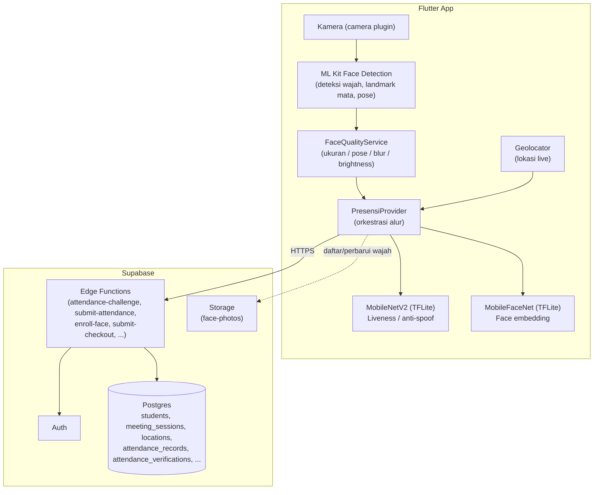
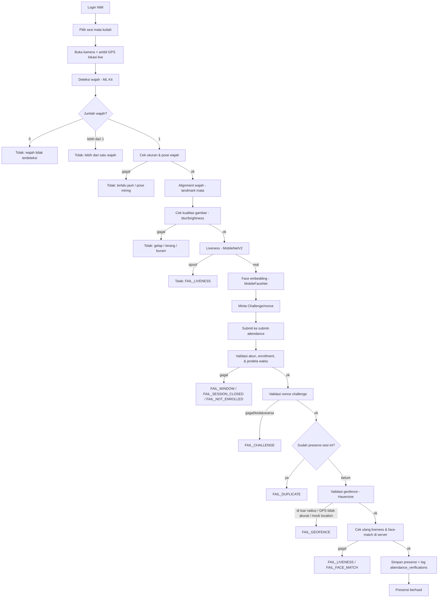

# Presensi Liveness — Sistem Presensi Mahasiswa

Purwarupa aplikasi mobile presensi mahasiswa anti-titip-absen: login NIM +
liveness detection wajah (MobileNetV2, real vs spoof) + **pencocokan
identitas wajah (face recognition, MobileFaceNet)** via TensorFlow Lite +
pencatatan lokasi live saat Clock In/Out. Dibangun untuk skripsi *"Sistem
Presensi Mahasiswa Menggunakan Metode Deep Learning MobileNet untuk
Deteksi Liveness Anti-Titip Absen dengan Geofencing di Universitas Saintek
Muhammadiyah Jakarta"*.

> **PENTING — perubahan metodologi berikut belum tercermin di proposal
> tertulis, perlu direvisi & didiskusikan ke dosen pembimbing (Bapak
> Fitrah Juliansyah) sebelum diajukan lebih lanjut:**
>
> 1. **Face recognition ditambahkan (Opsi A).** Proposal yang ada
>    (`Proposal_Skripsi_...docx`) eksplisit menulis di Batasan Masalah
>    bahwa penelitian ini **"belum mencakup pengembangan model pengenalan
>    wajah (face recognition)"**, dan di Saran memposisikannya sebagai PR
>    peneliti selanjutnya. Kode SEKARANG SUDAH menambahkan face recognition.
>
> Proposal ini juga masih punya beberapa placeholder Bab III (profil
> kampus) yang belum dilengkapi dari sesi sebelumnya.
>
> **Catatan geofencing (per revisi terbaru):** geofencing **tetap dipakai**
> dan **aktif divalidasi** di backend — lihat bagian "Geofencing (validasi
> lokasi)" di bawah untuk detail radius, metode perhitungan jarak, dan
> aturan per mode ONLINE/OFFLINE. Dokumen ini sebelumnya sempat menyatakan
> validasi radius "dihapus", yang sudah tidak sesuai dengan kode saat ini
> dan sudah diperbaiki.

## Status saat ini

- Seluruh kode app (Flutter) sudah lengkap: semua menu (Beranda, Jadwal,
  Rekap, Wajah Terdaftar, Izin/Sakit, Kelola Kelas untuk dosen, Notifikasi)
  terhubung ke Supabase (PostgreSQL + Auth + Storage + Edge Functions),
  `flutter analyze` bersih.
- **Firebase sudah sepenuhnya dihapus** dari project ini (auth, Firestore,
  dependency, konfigurasi Android) - backend sekarang murni Supabase, lihat
  skema di `supabase/migrations/`.
- Model `assets/models/model.tflite` (liveness, MobileNetV2) SUDAH ada —
  **wajib dikalibrasi** sebelum dipakai untuk pengujian/sidang, lihat bagian
  "Model Liveness" di bawah.
- Model `assets/models/mobilefacenet.tflite` (pencocokan identitas wajah)
  SUDAH ada — lihat bagian "Model Face Recognition" di bawah untuk detail &
  catatan kalibrasi threshold-nya.

## Arsitektur & Alur Sistem

Fungsi masing-masing komponen inti:

- **MobileNetV2** → mendeteksi wajah asli vs spoof (liveness/anti-spoofing).
- **MobileFaceNet** → mengenali identitas wajah (mencocokkan dengan foto
  referensi yang didaftarkan mahasiswa).
- **Geofencing** → memvalidasi lokasi mahasiswa terhadap radius kelas
  (lihat bagian "Geofencing" di bawah untuk detail radius/metode).

### Diagram arsitektur



### Diagram alur presensi (sesuai kode saat ini)



Detail tiap tahap (kalibrasi, threshold, dsb.) ada di bagian-bagian di
bawah — Model Liveness, Model Face Recognition, Geofencing, Anti-replay,
Kualitas wajah & alignment.

## 1. Setup Supabase (WAJIB sebelum app bisa dipakai penuh)

1. Buat project di [supabase.com](https://supabase.com) (atau jalankan
   Supabase lokal lewat Supabase CLI: `supabase start`).
2. Terapkan skema database: `supabase db push` (menjalankan seluruh file di
   `supabase/migrations/` secara berurutan), lalu (opsional) `supabase db
   seed` untuk data contoh (`supabase/seed.sql`).
3. Deploy Edge Functions yang dipakai app: `supabase functions deploy` untuk
   tiap fungsi di `supabase/functions/` (`activate-account`,
   `admin-provision-user`, `attendance-challenge`, `enroll-face`,
   `submit-attendance`, `submit-checkout`).
4. Di **Authentication → Providers → Email**, matikan **"Confirm email"** -
   app memakai email sintetis (`<NIM>@smartattendance.app`, lihat
   `lib/core/services/supabase_auth_service.dart`) yang tidak pernah bisa
   menerima email konfirmasi sungguhan.
5. Isi `env/dev.json` dengan `SUPABASE_URL` & `SUPABASE_ANON_KEY` project
   Anda, lalu jalankan app dengan:

   ```bash
   flutter run --dart-define-from-file=env/dev.json
   ```

   (Run configuration `main.dart` di Android Studio/.idea sudah diset untuk
   otomatis menyertakan argumen ini.)

Foto wajah terdaftar disimpan di bucket Storage privat `face-photos` (lewat
Edge Function `enroll-face`, embedding-nya di tabel `face_profiles` yang
tidak bisa dibaca langsung oleh client), dan lampiran bukti izin/sakit di
bucket `leave-attachments`. Tidak ada lagi penyimpanan Base64 di dokumen
database seperti versi Firestore dulu.

### Data awal

Belum ada integrasi SIAKAD. Data akademik (fakultas/prodi/mata kuliah/kelas/
jadwal) dikelola lewat SQL langsung (lihat `supabase/seed_prodi_2026.sql`
sebagai contoh) atau Web Admin terpisah - **bukan lagi lewat mobile app**,
menu "Kelola Jadwal" di app sudah dihapus. Akun mahasiswa/dosen didaftarkan
sendiri lewat layar Daftar (role dipilih manual saat registrasi), atau
diprovisioning admin lewat Edge Function `admin-provision-user`.

## 2. Model Liveness (MobileNetV2 real/spoof)

Sesuai kesepakatan: app ini pakai model **pretrained siap pakai** (bukan
training dari nol), dari repo `biometric-technologies/liveness-detection-model`
(MIT license): https://github.com/biometric-technologies/liveness-detection-model/releases/tag/v0.2.0

File `assets/models/model.tflite` sudah ada di project ini. **Preprocessing
di kode Flutter mengikuti kode inferensi ASLI model tersebut (`pixel/255.0`,
skala 0..1)**, BUKAN skema `pixel/127.5-1.0` yang tertulis di draf awal
proposal — bagian metodologi/preprocessing di skripsi perlu direvisi kecil
supaya konsisten dengan kode (kalau butuh bantuan menulis ulang bagian itu,
tinggal minta).

### Kalibrasi (WAJIB sebelum demo/sidang)

Model ini punya satu neuron output sigmoid, dan repo sumbernya tidak
menyebutkan eksplisit arah label (skor tinggi = real atau spoof). Sebelum
dipakai serius:

```bash
pip install tensorflow pillow numpy
python scripts/calibrate_model.py --real contoh_foto/real --spoof contoh_foto/spoof
```

Siapkan folder `contoh_foto/real` (beberapa foto wajah asli, sudah di-crop
mirip wajah) dan `contoh_foto/spoof` (foto dari layar HP/print out, dsb).
Skrip akan menyarankan nilai `realIsHighScore` dan `threshold` yang perlu
di-set di `lib/core/services/liveness_service.dart` (dua konstanta itu sudah
diberi komentar jelas di file tersebut).

## 2b. Model Face Recognition (MobileFaceNet, pencocokan identitas)

Sesuai keputusan pindah ke Opsi A: setelah liveness memastikan wajah di
kamera itu asli (bukan foto/video), sistem JUGA mencocokkan wajah itu
dengan foto referensi yang didaftarkan mahasiswa (WAJIB diisi dulu sebelum
bisa presensi — kalau belum, tombol Clock In di Beranda otomatis nonaktif).
Akses layar pendaftaran wajah: tombol "Daftar Sekarang/Daftar Ulang" di
kartu Beranda, atau tap foto profil di pojok kiri atas drawer.

Model: `mobilefacenet.tflite` dari repo Flutter
`MCarlomagno/FaceRecognitionAuth` (BSD-3-Clause):
https://github.com/MCarlomagno/FaceRecognitionAuth — input wajah 112×112,
preprocessing `(pixel-128)/128`, output embedding 192 dimensi. Dua wajah
dianggap orang yang sama kalau jarak Euclidean antar embedding-nya
`<= 0.5` (nilai default dari repo sumber, konstanta `FaceMatching.threshold`
di `lib/core/utils/face_matching.dart`).

**Kalibrasi**: threshold `0.5` ini nilai umum dari reference repo-nya, BUKAN
hasil pengujian di dataset/device Anda sendiri. Sebelum sidang, uji manual
dengan beberapa mahasiswa (wajah sendiri vs wajah orang lain) dan sesuaikan
konstanta itu kalau perlu — catat proses pengujian ini di bab metodologi
karena relevan sebagai bagian dari pengujian sistem.

### Ringkasan preprocessing model (referensi cepat)

Detail lengkap ada di bagian "Model Liveness" dan "Model Face Recognition"
di atas — tabel ini cuma rangkuman biar gampang dikutip di bab metodologi
skripsi tanpa perlu menelusuri kode.

| | **MobileNetV2 (liveness)** | **MobileFaceNet (face recognition)** |
|---|---|---|
| Fungsi | Deteksi wajah asli vs spoof (anti-spoofing) | Mengenali identitas wajah (pencocokan embedding) |
| Ukuran input | 224×224×3 | 112×112×3 |
| Normalisasi piksel | `pixel / 255.0` (rentang 0..1) | `(pixel - 128) / 128` (rentang -1..1) |
| Output | 1 neuron, sigmoid (skor tunggal) | Vektor embedding 192 dimensi |
| Interpretasi output | Skor tinggi = real jika `realIsHighScore = true` (default, lihat `LivenessService.realIsHighScore`) | Embedding dibandingkan ke embedding referensi yang tersimpan di `face_profiles.embedding` |
| Label real/spoof | `probReal >= threshold` → real; sebaliknya → spoof (`LivenessService.threshold`, default `0.5`, **belum dikalibrasi**) | Metrik jarak: **Euclidean distance**; `distance <= threshold` → orang yang sama (`FaceMatching.threshold`, default `0.5`, **belum dikalibrasi**) |
| Sumber model | `biometric-technologies/liveness-detection-model` (MIT), pretrained | `MCarlomagno/FaceRecognitionAuth` (BSD-3-Clause), pretrained |
| Implementasi | `lib/core/services/liveness_service.dart` | `lib/core/services/face_embedding_service.dart`, `lib/core/utils/face_matching.dart` |

Kedua model **pretrained** (bukan hasil training ulang) — lihat bagian
"Di luar scope purwarupa ini" untuk catatan soal training dari nol.

## 2c. Geofencing (validasi lokasi)

Geofencing **tetap dipakai dan aktif divalidasi** — presensi ditolak
(`FAIL_GEOFENCE`, HTTP 422) kalau mahasiswa di luar radius, akurasi GPS
terlalu buruk, atau lokasi terdeteksi mock. Implementasi ada di
`supabase/functions/submit-attendance/index.ts`, bukan di client Flutter.

- **Metode jarak**: Haversine (`haversineMeters()` di
  `submit-attendance/index.ts`), jarak lurus antara koordinat device saat
  Clock In dan koordinat ruang/lokasi kelas.
- **Radius**: per-lokasi lewat kolom `locations.radius_meters` (10–5000 m,
  `supabase/migrations/0004_locations.sql`); kalau lokasi tidak punya
  radius eksplisit, fallback ke `app_settings.geofence_radius_meters`
  (default **150 m**, `supabase/migrations/0002_reference_config.sql`).
  `resolve_geofence()` (RPC, `0008_schedules_sessions.sql`) yang menentukan
  lokasi & radius efektif per sesi.
- **Toleransi akurasi GPS**: `app_settings.geofence_gps_accuracy_max_meters`
  (default 50 m) — kalau akurasi device lebih buruk dari itu, presensi
  ditolak meski jaraknya di dalam radius.
- **Deteksi mock location**: flag `is_mocked` dari client (Geolocator)
  langsung menolak presensi kalau `true`.
- **`require_geofence`**: kolom per-sesi di `meeting_sessions`
  (`0008_schedules_sessions.sql`), nullable. Aturannya `session.require_geofence
  ?? true` — **default aktif (true)** kalau kolom `NULL`; harus di-set
  eksplisit ke `false` untuk menonaktifkan validasi radius pada sesi
  tertentu. Ada juga override di level lokasi: `locations.is_geofenced`
  (default `true`) — kalau `false`, `resolve_geofence()` mengembalikan
  `enforced=false` (validasi di-skip untuk semua sesi di lokasi itu).
- **Mode ONLINE vs OFFLINE/HYBRID**:
  - Sesi `OFFLINE`/`HYBRID`: lokasi GPS **wajib** dikirim (tanpa itu ditolak
    `FAIL_MODE_MISMATCH`), dan validasi geofence berjalan penuh (tunduk ke
    `require_geofence`/`is_geofenced` di atas).
  - Sesi `ONLINE`: lokasi GPS tidak wajib, dan validasi geofence **di-skip
    secara default** lewat `app_settings.allow_online_geofence_bypass`
    (default `true`). Bisa dipaksa tetap divalidasi (kalau device tetap
    mengirim lokasi) dengan mematikan setting itu.

## 2d. Anti-replay (challenge/nonce)

Presensi **wajib** menyertakan sebuah nonce sekali-pakai yang diminta dari
Edge Function `attendance-challenge` sesaat sebelum `submit-attendance`
dipanggil (bukan lagi mengandalkan "jarak embedding wajah persis 0" sebagai
tanda replay — cara lama itu gampang dihindari dan mencampur konsep
kemiripan wajah dengan deteksi replay).

- Client meminta nonce (`AttendanceRepository.requestChallenge`) tepat
  sebelum submit, supaya jendela hidupnya (default TTL 120 detik,
  `app_settings.max_challenge_ttl_seconds`) tidak keburu habis oleh proses
  liveness+capture yang lama.
- Nonce disimpan di tabel `attendance_challenges`, terikat ke
  `student_id` + `meeting_session_id` saat diminta, dan hanya valid sekali
  (kolom `consumed_at` di-set saat commit presensi berhasil).
- `submit-attendance` menolak (`FAIL_CHALLENGE`) request tanpa
  `challenge_nonce`, atau nonce yang kedaluwarsa/sudah dipakai/tidak
  cocok dengan mahasiswa & sesi yang login.

## 2e. Kualitas wajah & alignment (sebelum liveness/face recognition)

Sebelum frame kamera masuk ke MobileNetV2/MobileFaceNet, ada gerbang
kualitas di `PresensiProvider.processFrame` (`lib/providers/presensi_provider.dart`):

1. **Jumlah wajah** — 0 wajah ditolak ("wajah tidak terdeteksi"), >1 wajah
   ditolak ("terdeteksi lebih dari satu wajah") — lihat bagian sebelumnya.
2. **Ukuran & pose** (`FaceQualityService.checkPose`, murah — pakai output
   detector langsung, tanpa crop) — wajah terlalu kecil (jauh dari kamera),
   atau menoleh/miring terlalu jauh (yaw/roll dari ML Kit) ditolak.
3. **Alignment** (`alignAndCropFace` di `lib/core/utils/face_crop_util.dart`)
   — kalau ML Kit berhasil mendeteksi titik mata, crop wajah diputar dulu
   supaya garis mata rata (horizontal) sebelum di-resize ke ukuran input
   model, bukan langsung crop mentah. Dipakai konsisten untuk liveness,
   face embedding saat presensi, dan saat pendaftaran wajah dari foto.
4. **Kualitas gambar** (`FaceQualityService.checkCroppedImage`, jalan di
   crop yang sama yang dipakai liveness — tidak crop dua kali) — terlalu
   gelap/terang (rata-rata brightness) atau buram (skor ketajaman gradien)
   ditolak.

**Catatan kalibrasi**: nilai ambang di `lib/core/constants/face_quality_config.dart`
(ukuran minimum piksel, batas yaw/roll, brightness, sharpness) adalah nilai
default yang longgar, **belum diuji di device/kondisi nyata** — sama seperti
`LivenessService.threshold`/`FaceMatching.threshold`. Sesuaikan berdasarkan
hasil pengujian jarak wajah & kondisi pencahayaan sebelum sidang.

## 3. Menjalankan / build APK

Environment build sudah tersedia (Flutter 3.38.7, Android SDK 36).

```bash
flutter pub get
flutter run                 # jalan di device/emulator Android yang terhubung
flutter build apk --release # hasil di build/app/outputs/flutter-apk/app-release.apk
```

Testing di emulator tanpa GPS asli: jalankan emulator, lalu set lokasi
lewat:

```bash
adb emu geo fix <longitude> <latitude>
```

**Perhatian**: berbeda dari `adb emu geo fix`, sistem mendeteksi
mock-location beneran (mis. lewat app "Fake GPS" di device fisik dengan
Developer Options → Mock location) via flag `is_mocked` dari client, dan
menolak presensi (`FAIL_GEOFENCE`) kalau flag itu `true` — lihat bagian
"Geofencing" di bawah.

## 4. Struktur proyek singkat

- `lib/core/` — services (auth, lokasi live, face detection ML Kit, liveness
  TFLite, face embedding/matching TFLite) & utils (konversi NV21→RGB, crop
  wajah bersama) & repository Supabase per tabel/fitur.
- `lib/models/` — model data (`UserModel`, `SessionTodayModel`, `IzinModel`,
  `NotifikasiModel`).
- `supabase/migrations/` — skema database (tabel, enum, RLS, trigger, RPC).
- `supabase/functions/` — Edge Functions (logika server-side sensitif seperti
  keputusan presensi & pendaftaran wajah).
- `lib/providers/` — state management (`provider` package).
- `lib/features/` — satu folder per menu/fitur.
- `scripts/calibrate_model.py` — kalibrasi model liveness (lihat di atas).

### Konvensi pemisahan business logic dari UI

Pola yang dipakai: `Widget → Provider → Service/Repository → Backend` untuk
layar dengan alur multi-langkah atau state yang dibagi antar widget
(`PresensiProvider` untuk presensi, `FaceEnrollmentProvider` untuk
pendaftaran wajah, `IzinProvider`, dsb — semua didaftarkan di `app.dart`).
Layar baca-tampilkan sederhana (rekap, jadwal, daftar hadir per kelas)
boleh langsung `Widget → Repository` tanpa Provider — ini pola yang
disengaja untuk kasus sederhana, bukan pelanggaran. Tidak ada widget yang
memanggil `Supabase.instance.client` langsung atau melakukan kalkulasi
bisnis (perhitungan jarak, keputusan threshold, jendela waktu) — itu semua
ada di service/repository/Edge Function.

## 4b. Unit test

- **Dart** (`flutter test`): `test/face_matching_test.dart` (jarak Euclidean
  & keputusan threshold pencocokan wajah), `test/liveness_service_test.dart`
  (keputusan threshold liveness, termasuk kasus `realIsHighScore` terbalik
  dan batas nilai persis di threshold), `test/face_crop_util_test.dart`
  (perhitungan sudut roll dari titik mata untuk alignment), dan
  `test/face_quality_service_test.dart` (gerbang kualitas: ukuran/pose,
  brightness, sharpness). Logika threshold liveness dipisah jadi fungsi
  murni `LivenessService.decide()` supaya bisa dites tanpa interpreter
  TFLite/kamera.
- **Deno** (`deno test supabase/functions/_shared/verification_test.ts`,
  butuh Deno CLI terpasang — lihat https://deno.com): mencakup Haversine
  distance, validasi geofence (radius/akurasi GPS/mock location), keputusan
  threshold face-match & liveness, jendela waktu presensi (buka/tutup/
  terlambat), dan validasi nonce challenge (kedaluwarsa/sekali-pakai/
  terikat mahasiswa+sesi). Logika ini diekstrak ke
  `supabase/functions/_shared/verification.ts` (fungsi murni, tanpa panggilan
  DB) supaya bisa dites tanpa instance Supabase yang jalan.
- **Integration test** (`deno test --allow-net --allow-env supabase/tests/attendance_flow_test.ts`,
  butuh `supabase start` lokal — lihat komentar di kepala file untuk env var
  yang perlu di-export): menjalankan alur lengkap login → minta challenge →
  liveness+face recognition (disimulasikan lewat skor/embedding sintetis,
  karena kamera/ML Kit/TFLite tidak bisa dijalankan tanpa device fisik) →
  validasi geofence → submit → presensi berhasil, ditambah seluruh baris
  tabel negative test case di bawah dalam satu file yang sama. **Belum
  saya jalankan** di sesi ini (tidak ada Deno CLI maupun instance Supabase
  lokal di lingkungan kerja saya) — jalankan sendiri sebelum mengandalkannya.

### Tabel negative test case (item pengujian negatif)

| Skenario | Expected | Dites di |
|---|---|---|
| Wajah benar | ✅ PASS | `attendance_flow_test.ts` (happy path) |
| Wajah orang lain | ❌ FAIL_FACE_MATCH | `attendance_flow_test.ts` |
| Foto HP / cetak / video | ❌ FAIL_LIVENESS | `attendance_flow_test.ts` (skor liveness rendah — backend tidak bisa membedakan medium spoof-nya, lihat catatan di file) |
| Tidak ada wajah | ❌ (client-side, tidak pernah kirim request) | `test/face_quality_service_test.dart` + `PresensiProvider.processFrame` |
| Dua wajah | ❌ (client-side, tidak pernah kirim request) | `PresensiProvider.processFrame` (`faces.length > 1`) |
| Di luar geofence | ❌ FAIL_GEOFENCE | `attendance_flow_test.ts` + `verification_test.ts` (`evaluateGeofence`) |
| GPS tidak akurat | ❌ FAIL_GEOFENCE | `attendance_flow_test.ts` + `verification_test.ts` |
| Mock location | ❌ FAIL_GEOFENCE | `attendance_flow_test.ts` + `verification_test.ts` |
| Di luar jam presensi | ❌ FAIL_WINDOW | `attendance_flow_test.ts` + `verification_test.ts` (`evaluateAttendanceWindow`) |
| Presensi dua kali | ❌ FAIL_DUPLICATE | `attendance_flow_test.ts` |
| Nonce kedaluwarsa/tidak valid | ❌ FAIL_CHALLENGE | `attendance_flow_test.ts` + `verification_test.ts` (`evaluateChallenge`) |

## 5. Di luar scope purwarupa ini (dicatat, bukan lupa)

- Training model dari nol / dataset asli kampus — bisa ditambahkan belakangan
  kalau butuh, tapi sesuai kesepakatan awal, sesi ini pakai model pretrained.
- Push notification OS-level (FCM/APNs) — menu Notifikasi hanya daftar
  pengumuman dari tabel `notifications`, tanpa push ke luar app.
- Integrasi SIAKAD nyata — data akademik dikelola manual lewat SQL/Web Admin
  terpisah, bukan lewat mobile app.
- Provisioning akun produksi oleh admin — untuk demo, akun mahasiswa/dosen
  didaftarkan sendiri lewat layar Daftar (role dipilih manual saat registrasi).
